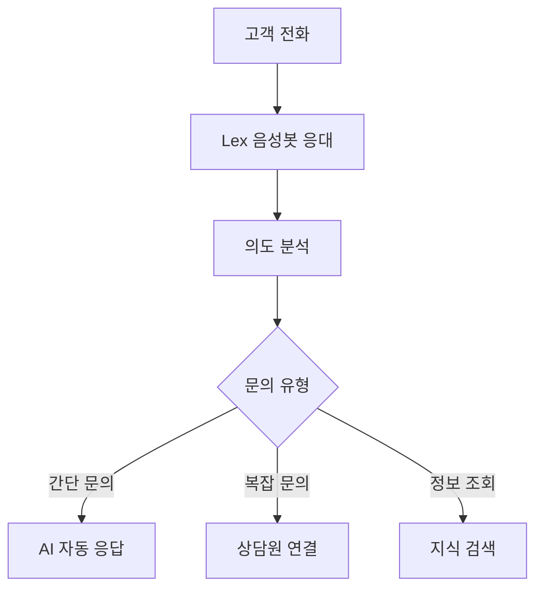
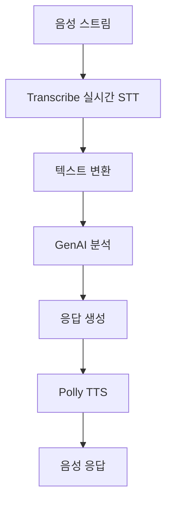

# OO금융지주 AI 기반 클라우드 컨택센터(AICC) 시스템 설계 문서

## 개요

Amazon Connect를 기반으로 한 AI 기반 클라우드 컨택센터 시스템 설계. 실시간 STT/TTS, GenAI 응답, 감정 분석, 지식 검색 등 AI 기술을 통합하여 고객 경험을 혁신하고 운영 효율성을 극대화합니다.

## 아키텍처

### 전체 시스템 구조
```
고객 전화 → Amazon Connect → AI 음성봇(Lex) → 실시간 STT(Transcribe)
                ↓                                    ↓
        Contact Flow 라우팅                    GenAI 응답 생성
                ↓                                    ↓
        감정 분석(Comprehend)                  TTS 음성 변환(Polly)
                ↓                                    ↓
        지식 검색(Kendra)                     상담원 Dashboard
                ↓                                    ↓
        Vector DB 검색                        CRM/DB 연동
                ↓                                    ↓
        상담원 연결                           리포트/통계
```

### AI 기반 처리 Flow
**AI-First 접근 방식**으로 고객 문의를 자동화하고 필요시에만 상담원 연결:

1. **AI Voice Bot Flow**: Lex 기반 초기 응대 및 의도 파악
2. **Real-time STT Flow**: Transcribe를 통한 실시간 음성 인식
3. **GenAI Response Flow**: 고객 질의에 대한 AI 자동 응답
4. **Emotion Analysis Flow**: Comprehend 기반 감정 분석 및 라우팅
5. **Knowledge Search Flow**: Kendra + Vector DB 기반 지식 검색
6. **Agent Handoff Flow**: 복잡한 문의 시 상담원 연결

## 컴포넌트 및 인터페이스

### 1. AI 음성봇 및 Contact Flows

#### 1.1 AI Voice Bot (Amazon Lex)
**목적**: 자연어 이해 기반 초기 고객 응대
**입력**: 고객 음성 입력
**출력**: 의도 파악 및 적절한 Flow 라우팅



#### 1.2 Real-time STT Flow (Amazon Transcribe)
**목적**: 실시간 음성을 텍스트로 변환
**입력**: 고객 음성 스트림
**출력**: 실시간 텍스트 변환 결과



#### 1.3 GenAI Response Flow
**목적**: 고객 질의에 대한 AI 기반 자동 응답
**특징**: 실시간 응답, 지식 베이스 연동

#### 1.4 Emotion Analysis Flow (Amazon Comprehend)
**목적**: 실시간 감정 분석 및 상담원 라우팅
**특징**: 부정적 감정 감지 시 우선 처리

#### 1.5 Knowledge Search Flow (Amazon Kendra + Vector DB)
**목적**: 지식 베이스 검색 및 응답 추천
**특징**: 벡터 유사도 검색, 실시간 추천

#### 1.6 Agent Dashboard Flow
**목적**: 상담원 전용 인터페이스 제공
**특징**: 실시간 정보 표시, CRM 연동

### 2. AI 및 Lambda Functions

#### 2.1 GenAI Response Function
```python
def lambda_handler(event, context):
    # STT 결과를 받아 GenAI로 응답 생성
    # 지식 베이스 검색 결과 활용
    # 컨텍스트 기반 개인화 응답
    # TTS용 텍스트 반환
```

#### 2.2 Real-time STT Processing Function
```python
def lambda_handler(event, context):
    # Transcribe 스트림 처리
    # 실시간 텍스트 변환 결과 처리
    # 감정 분석 연동
    # 상담원 화면 실시간 업데이트
```

#### 2.3 Emotion Analysis Function
```python
def lambda_handler(event, context):
    # Comprehend 감정 분석 수행
    # 부정적 감정 감지 시 알림
    # 상담원 라우팅 우선순위 조정
    # 실시간 대시보드 업데이트
```

#### 2.4 Knowledge Search Function
```python
def lambda_handler(event, context):
    # Kendra 지식 검색 수행
    # Vector DB 유사도 검색
    # 검색 결과 랭킹 및 필터링
    # 상담원 추천 답변 제공
```

#### 2.5 CRM Integration Function
```python
def lambda_handler(event, context):
    # Oracle DB 고객 정보 조회
    # CRM 시스템 연동
    # 상담 내용 자동 기록
    # SMS/알림톡 발송 연동
```

#### 2.6 Vector DB Management Function
```python
def lambda_handler(event, context):
    # 문서 임베딩 생성 및 저장
    # Vector 유사도 검색 수행
    # 지식 베이스 업데이트 처리
    # 검색 성능 최적화
```

### 3. 데이터 저장소

#### 3.1 Customer Database (DynamoDB)
```json
{
  "customer_id": "string",
  "company_name": "string",
  "aws_account_id": "string",
  "support_level": "MSP|General",
  "assigned_engineer": "string",
  "contact_info": {
    "phone": "string",
    "email": "string"
  },
  "created_at": "timestamp",
  "updated_at": "timestamp"
}
```

#### 3.2 Call Logs (DynamoDB)
```json
{
  "call_id": "string",
  "customer_id": "string",
  "phone_number": "string",
  "call_start_time": "timestamp",
  "call_end_time": "timestamp",
  "flow_path": "string",
  "resolution": "string",
  "assigned_to": "string"
}
```

### 4. 큐 시스템

#### 4.1 MSP Emergency Queue
- **우선순위**: 최고
- **SLA**: 15분 내 응답
- **담당자**: TS 팀 정담당자 → 부담당자 → 파트 내 다른 구성원

#### 4.2 MSP General Queue
- **우선순위**: 높음
- **SLA**: 30분 내 응답
- **담당자**: TS 팀 담당자

#### 4.3 General Customer Queue
- **우선순위**: 보통
- **SLA**: 1시간 내 응답
- **담당자**: General 티켓 담당자 (순환 배정)

#### 4.4 After Hours Queue
- **우선순위**: 낮음
- **처리**: 다음 업무일 처리
- **담당자**: 당일 COC 담당자

## 데이터 모델

### Customer Entity
```typescript
interface Customer {
  customerId: string;
  companyName: string;
  awsAccountId: string;
  supportLevel: 'MSP' | 'General';
  assignedEngineer?: string;
  contactInfo: {
    phone: string;
    email: string;
  };
  createdAt: Date;
  updatedAt: Date;
}
```

### Call Log Entity
```typescript
interface CallLog {
  callId: string;
  customerId?: string;
  phoneNumber: string;
  callStartTime: Date;
  callEndTime?: Date;
  flowPath: string[];
  resolution: string;
  assignedTo?: string;
  notes?: string;
}
```

### Engineer Entity
```typescript
interface Engineer {
  engineerId: string;
  name: string;
  phone: string;
  email: string;
  part: 'Leaf' | 'Tiger' | 'Aqua';
  role: 'Leader' | 'Member';
  isAvailable: boolean;
  currentLoad: number;
}
```

## 오류 처리

### 1. 음성 인식 실패
- **재시도**: 최대 3회
- **폴백**: DTMF 입력으로 전환
- **최종 실패**: 상담원 연결

### 2. 고객 정보 조회 실패
- **미등록 고객**: 신규 고객 처리 Flow
- **시스템 오류**: 상담원 연결
- **부분 매칭**: 수동 확인 요청

### 3. 담당자 연결 실패
- **1차**: 정담당자
- **2차**: 부담당자
- **3차**: 파트 내 다른 구성원
- **최종**: General 담당자

### 4. 시스템 장애
- **Lambda 오류**: 기본 Flow로 폴백
- **DB 연결 실패**: 캐시된 정보 사용
- **전체 장애**: 모든 호출을 상담원 연결

## 테스트 전략

### 1. 단위 테스트
- 각 Lambda 함수별 테스트
- Contact Flow 개별 블록 테스트
- 데이터 모델 검증

### 2. 통합 테스트
- Flow 간 연동 테스트
- Lambda와 DynamoDB 연동
- 큐 시스템 동작 확인

### 3. 시나리오 테스트
- MSP 고객 긴급 장애 시나리오
- 일반 고객 업무시간 중 문의
- 업무시간 외 처리
- 시스템 장애 상황

### 4. 성능 테스트
- 동시 통화 처리 능력
- 응답 시간 측정
- 리소스 사용량 모니터링

## 모니터링 및 알림

### 1. 실시간 모니터링
- 통화량 모니터링
- 큐 대기시간 추적
- 시스템 성능 지표

### 2. 알림 설정
- 대기시간 초과 알림
- 시스템 오류 알림
- 담당자 부재 알림

### 3. 대시보드
- 실시간 통화 현황
- 고객 분류 통계
- 담당자 업무 부하

## 보안 고려사항

### 1. 개인정보 보호
- 고객 정보 암호화 저장
- 통화 녹음 보안 처리
- 접근 권한 관리

### 2. 인증 및 권한
- AWS Account ID 검증
- 담당자 권한 확인
- 시스템 접근 로그

### 3. 데이터 보존
- 통화 로그 보존 기간
- 개인정보 삭제 정책
- 백업 및 복구 절차

---

**설계 완료일**: 2025-08-05  
**설계자**: Saltware 개발팀  
**검토 상태**: 설계 완료, 구현 대기