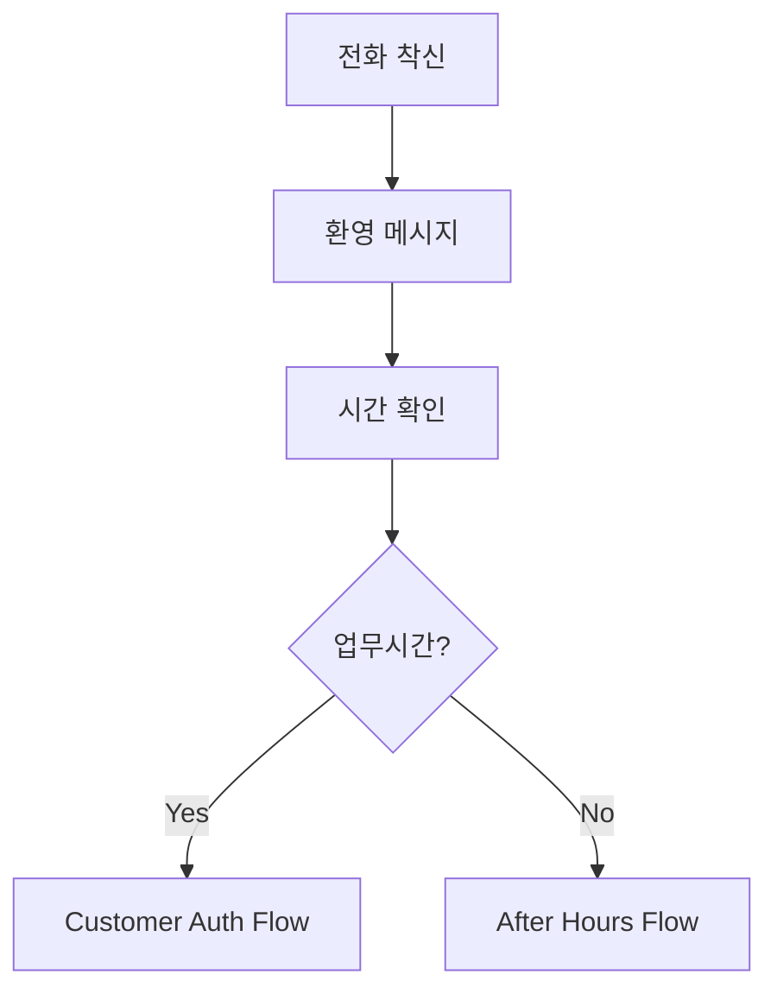
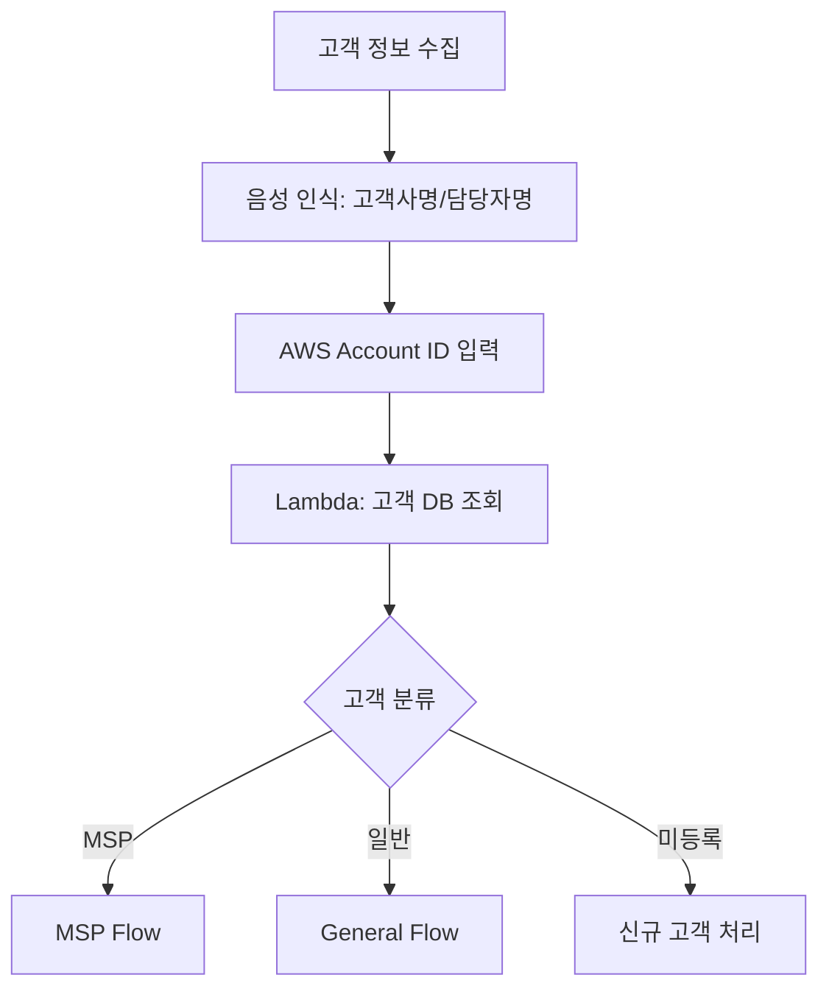

# Saltware IVR 시스템 설계 문서

## 개요

기존 COC 업무 가이드를 기반으로 한 실용적인 IVR 시스템 설계. 고객을 정확히 분류하고 적절한 담당자에게 연결하는 것이 핵심 목표입니다.

## 아키텍처

### 전체 시스템 구조
```
전화 착신 → Main IVR Flow → 고객 분류 → 세부 처리 Flow들
                ↓
        [고객 정보 수집] → [인증] → [분류] → [라우팅]
                ↓
        Lambda Functions (고객 DB 조회, 시간 확인, 로깅)
                ↓
        DynamoDB (고객 정보), CloudWatch (모니터링)
```

### Contact Flow 분리 전략
단일 Flow로는 복잡성 관리가 어려우므로 **모듈화된 Flow 구조** 채택:

1. **Main Entry Flow**: 초기 접수 및 기본 분류
2. **Customer Authentication Flow**: 고객 정보 수집 및 인증
3. **MSP Customer Flow**: MSP 고객 전용 처리
4. **General Customer Flow**: 일반 고객 처리
5. **After Hours Flow**: 업무시간 외 처리
6. **Emergency Flow**: 긴급 상황 처리

## 컴포넌트 및 인터페이스

### 1. Contact Flows

#### 1.1 Main Entry Flow
**목적**: 초기 접수 및 기본 라우팅
**입력**: 고객 전화
**출력**: 적절한 세부 Flow로 전환



#### 1.2 Customer Authentication Flow
**목적**: 고객 정보 수집 및 인증
**입력**: Main Flow에서 전환
**출력**: 인증된 고객 정보 + 분류 결과



#### 1.3 MSP Customer Flow
**목적**: MSP 고객 전용 처리
**특징**: 우선 처리, 15분 내 콜백 약속

#### 1.4 General Customer Flow
**목적**: 일반 고객 처리
**특징**: 이메일 우선 안내, 필요시 담당자 연결

#### 1.5 After Hours Flow
**목적**: 업무시간 외 처리
**특징**: 이메일 안내, 긴급시 특별 처리

#### 1.6 Emergency Flow
**목적**: 긴급 상황 우선 처리
**특징**: 최우선 큐, 즉시 연결

### 2. Lambda Functions

#### 2.1 Customer Lookup Function
```python
def lambda_handler(event, context):
    # 고객사명, AWS Account ID로 고객 정보 조회
    # MSP vs 일반 고객 분류
    # 담당자 정보 반환
```

#### 2.2 Business Hours Check Function
```python
def lambda_handler(event, context):
    # 현재 시간이 업무시간인지 확인
    # 한국 시간 기준 평일 09:00-18:00
    # 공휴일 처리 포함
```

#### 2.3 Call Logging Function
```python
def lambda_handler(event, context):
    # 통화 정보 로깅
    # 고객 정보, 처리 결과, 담당자 배정 등
    # CloudWatch 및 DynamoDB에 저장
```

#### 2.4 Ticket Creation Function
```python
def lambda_handler(event, context):
    # 자동 티켓 생성
    # Zendesk API 연동
    # 담당자 자동 배정
```

### 3. 데이터 저장소

#### 3.1 Customer Database (DynamoDB)
```json
{
  "customer_id": "string",
  "company_name": "string",
  "aws_account_id": "string",
  "support_level": "MSP|General",
  "assigned_engineer": "string",
  "contact_info": {
    "phone": "string",
    "email": "string"
  },
  "created_at": "timestamp",
  "updated_at": "timestamp"
}
```

#### 3.2 Call Logs (DynamoDB)
```json
{
  "call_id": "string",
  "customer_id": "string",
  "phone_number": "string",
  "call_start_time": "timestamp",
  "call_end_time": "timestamp",
  "flow_path": "string",
  "resolution": "string",
  "assigned_to": "string"
}
```

### 4. 큐 시스템

#### 4.1 MSP Emergency Queue
- **우선순위**: 최고
- **SLA**: 15분 내 응답
- **담당자**: TS 팀 정담당자 → 부담당자 → 파트 내 다른 구성원

#### 4.2 MSP General Queue
- **우선순위**: 높음
- **SLA**: 30분 내 응답
- **담당자**: TS 팀 담당자

#### 4.3 General Customer Queue
- **우선순위**: 보통
- **SLA**: 1시간 내 응답
- **담당자**: General 티켓 담당자 (순환 배정)

#### 4.4 After Hours Queue
- **우선순위**: 낮음
- **처리**: 다음 업무일 처리
- **담당자**: 당일 COC 담당자

## 데이터 모델

### Customer Entity
```typescript
interface Customer {
  customerId: string;
  companyName: string;
  awsAccountId: string;
  supportLevel: 'MSP' | 'General';
  assignedEngineer?: string;
  contactInfo: {
    phone: string;
    email: string;
  };
  createdAt: Date;
  updatedAt: Date;
}
```

### Call Log Entity
```typescript
interface CallLog {
  callId: string;
  customerId?: string;
  phoneNumber: string;
  callStartTime: Date;
  callEndTime?: Date;
  flowPath: string[];
  resolution: string;
  assignedTo?: string;
  notes?: string;
}
```

### Engineer Entity
```typescript
interface Engineer {
  engineerId: string;
  name: string;
  phone: string;
  email: string;
  part: 'Leaf' | 'Tiger' | 'Aqua';
  role: 'Leader' | 'Member';
  isAvailable: boolean;
  currentLoad: number;
}
```

## 오류 처리

### 1. 음성 인식 실패
- **재시도**: 최대 3회
- **폴백**: DTMF 입력으로 전환
- **최종 실패**: 상담원 연결

### 2. 고객 정보 조회 실패
- **미등록 고객**: 신규 고객 처리 Flow
- **시스템 오류**: 상담원 연결
- **부분 매칭**: 수동 확인 요청

### 3. 담당자 연결 실패
- **1차**: 정담당자
- **2차**: 부담당자
- **3차**: 파트 내 다른 구성원
- **최종**: General 담당자

### 4. 시스템 장애
- **Lambda 오류**: 기본 Flow로 폴백
- **DB 연결 실패**: 캐시된 정보 사용
- **전체 장애**: 모든 호출을 상담원 연결

## 테스트 전략

### 1. 단위 테스트
- 각 Lambda 함수별 테스트
- Contact Flow 개별 블록 테스트
- 데이터 모델 검증

### 2. 통합 테스트
- Flow 간 연동 테스트
- Lambda와 DynamoDB 연동
- 큐 시스템 동작 확인

### 3. 시나리오 테스트
- MSP 고객 긴급 장애 시나리오
- 일반 고객 업무시간 중 문의
- 업무시간 외 처리
- 시스템 장애 상황

### 4. 성능 테스트
- 동시 통화 처리 능력
- 응답 시간 측정
- 리소스 사용량 모니터링

## 모니터링 및 알림

### 1. 실시간 모니터링
- 통화량 모니터링
- 큐 대기시간 추적
- 시스템 성능 지표

### 2. 알림 설정
- 대기시간 초과 알림
- 시스템 오류 알림
- 담당자 부재 알림

### 3. 대시보드
- 실시간 통화 현황
- 고객 분류 통계
- 담당자 업무 부하

## 보안 고려사항

### 1. 개인정보 보호
- 고객 정보 암호화 저장
- 통화 녹음 보안 처리
- 접근 권한 관리

### 2. 인증 및 권한
- AWS Account ID 검증
- 담당자 권한 확인
- 시스템 접근 로그

### 3. 데이터 보존
- 통화 로그 보존 기간
- 개인정보 삭제 정책
- 백업 및 복구 절차

---

**설계 완료일**: 2025-08-05  
**설계자**: Saltware 개발팀  
**검토 상태**: 설계 완료, 구현 대기